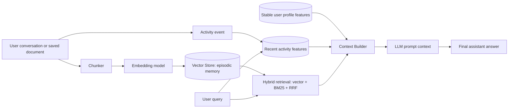

# Hybrid Memory Assistant Architecture

Contributor: Nguyen Viet Thanh

This POC designs a personal AI memory system for Vietnamese users. The goal is not to call a real LLM, but to assemble the context that an LLM would receive: the user's stable profile, recent activity, and the top episodic memories retrieved from a vector store. The design follows the Day 19 split: vector store for unstructured memories, feature store for stable and recent user features, and a final context assembly step before generation.

## Decision 1: Chunking Strategy

I chunk episodic memory by short semantic passages instead of storing an entire conversation as one record. In the POC, `remember()` splits text on sentence boundaries and groups nearby sentences into small chunks. This gives retrieval a smaller target: a query about Kubernetes can retrieve the Kubernetes paragraph rather than a whole mixed conversation about Kubernetes, security, and mobile apps.

The tradeoff is retrieval quality versus storage cost and context window size. Per-message chunks are cheap and precise, but they can lose context when one idea spans multiple messages. Per-conversation chunks preserve context, but retrieval becomes noisy because one hit may contain many unrelated topics. Semantic chunks are a middle point: more vectors than per-conversation storage, but less noise than storing entire conversations. For a Vietnamese personal assistant, this matters because users often mix Vietnamese explanations with English technical terms such as "Kubernetes", "autoscaling", "JWT", or "RAG". Small chunks let exact English terms and Vietnamese paraphrases both point to the right memory.

## Decision 2: Feature Schema

The feature store keeps stable and recent user features as tabular values. The stable profile entity is `user_id`, with features such as `preferred_language`, `topic_affinity`, `reading_speed_wpm`, and `active_hours`. Recent activity uses the same entity and keeps `queries_last_hour`, `recent_topics`, and `last_query`. I chose tabular features over embedding features for the core profile because they are easy to inspect, update, and use for business rules. For example, if `topic_affinity=cloud`, retrieval can boost cloud memories or the context builder can recommend cloud documents next.

The tradeoff is interpretability versus expressiveness. Embedding features could capture latent preferences from long-term history, but they are harder to debug and harder to explain to a user. Tabular features are less expressive, but they make TTL and point-in-time behavior clearer. Stable profile values can have a long TTL, for example 30 days, while recent activity should have a short TTL, for example one hour. This follows the Feast lesson from NB4: a reading-speed profile should not expire every minute, but query velocity should become stale quickly.

## Decision 3: Freshness Strategy

The system uses different freshness targets for different memory types. New episodic memory should be searchable immediately after `remember()` because users expect "what did I just save?" to work right away. Recent activity should update within seconds to minutes because it supports short-term personalization such as "what am I focused on lately?" Stable profile features can refresh daily or weekly because language preference and reading speed change slowly.

The tradeoff is freshness versus cost and operational complexity. Sub-second streaming for every profile feature is expensive and unnecessary. Daily batch refresh for everything is simple, but it makes recent recommendations feel stale. A mixed strategy is better: vector memory is written synchronously, recent activity is updated with a short TTL, and stable features are refreshed by batch. This design also connects to PIT joins: training examples should see only the profile and activity values that existed at the query time, not future values.

## Vietnamese Context

Vietnamese users often code-switch: "tự động mở rộng Kubernetes cluster", "JWT bảo mật API", or "recommend đọc gì tiếp về cloud". They may also type without accents or use phonetic shortcuts. The POC keeps whitespace tokenization for BM25 because it is transparent, but a production system should evaluate `underthesea` or `pyvi` for Vietnamese tokenization. I would still keep English technical terms intact because many Vietnamese technical queries depend on exact terms. Privacy is also important: personal notes and reading history are sensitive, so the vector store must filter by `user_id` and avoid cross-user retrieval. For a stronger production version, I would add per-user encryption keys and memory deletion APIs.

## Rejected Alternative

I considered storing episodic memory as an embedding feature inside the feature store. I rejected that because episodic memory and profile features have different lifecycles. Memories are appended frequently and searched semantically, while profile features are materialized by entity and retrieved by key. Mixing them would make re-indexing and deletion harder. A separate vector store for episodic memory plus a feature store for profile and activity keeps each system aligned with its job.

## What This POC Does Not Handle Yet

This POC does not implement encryption at rest, memory deletion, cross-device sync, or a real Feast registry. It uses an in-memory feature store so the demo is easy to run. It also does not call a real LLM; `recall()` returns the assembled context string that would be passed to the model.
